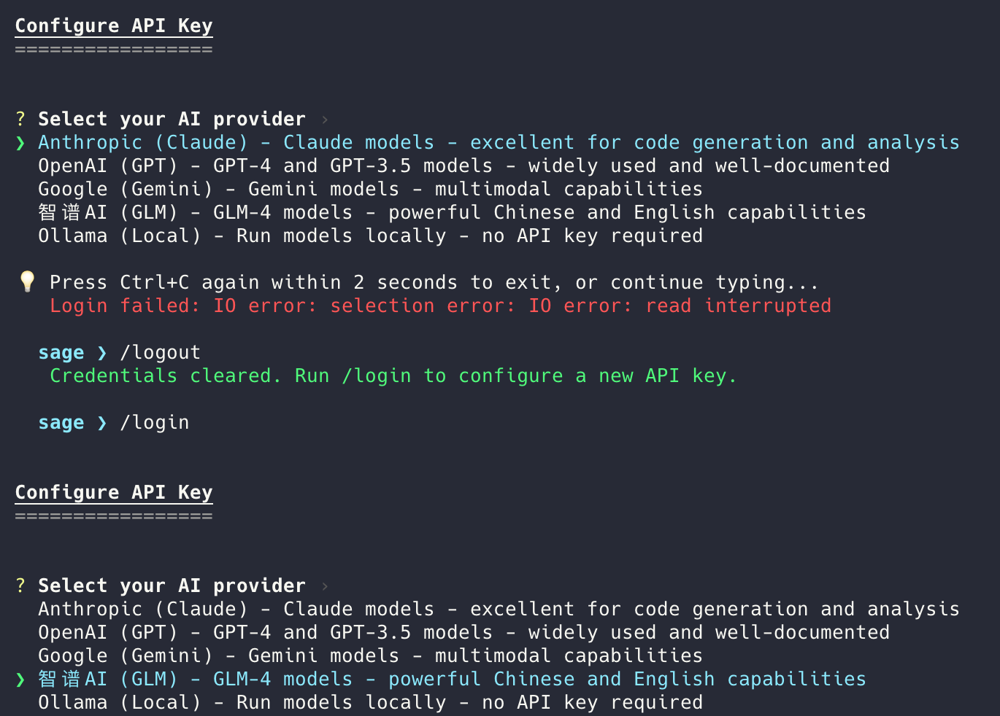

<div align="center">

# Sage 🦀

**Rust-native code agent in a single binary**

Open-source software engineering agent CLI.<br/>
Local startup benchmark • Single binary • Works offline with Ollama

[](https://www.rust-lang.org/)
[](LICENSE)
[](https://github.com/majiayu000/sage/actions)
[](https://github.com/majiayu000/sage/releases)

[Installation](#-quick-install) • [Features](#-features) • [Documentation](#-documentation) • [Contributing](#-contributing)

</div>

---

<!-- Demo GIF placeholder - record with: vhs demo/demo.tape -->
<!--
<div align="center">
  
</div>
-->

## Why Sage?

|  | Claude Code | Aider | **Sage** |
|---|:---:|:---:|:---:|
| **Startup Time** | ~500ms | ~800ms | **~50ms** |
| **Binary Size** | ~200MB | ~100MB | **~15MB** |
| **Offline Mode** | ❌ | ✅ | **✅ Ollama** |
| **Open Source** | ❌ | ✅ | **✅** |
| **MCP Support** | ✅ | ❌ | **✅** |
| **Memory System** | ❌ | ❌ | **✅** |
| **Single Binary** | ❌ | ❌ | **✅** |

## 🚀 Quick Install

**macOS / Linux:**
```bash
curl -fsSL https://raw.githubusercontent.com/majiayu000/sage/main/install.sh | bash
```

**Cargo (Sage CLI):**
```bash
cargo install sage-cli
```

**Homebrew:**
```bash
brew install majiayu000/sage/sage
```

## Release Status

- Latest verified GitHub release: [`v0.13.57`](https://github.com/majiayu000/sage/releases/tag/v0.13.57), published on 2026-04-30.
- GitHub release archives are the primary binary distribution path for macOS and Linux.
- Cargo installs use the `sage-cli` package (`cargo install sage-cli`); the root workspace package named `sage` is private and is not the CLI package on crates.io.
- Homebrew installs use the `majiayu000/sage` tap.

## ⚡ Quick Start

```bash
# Interactive mode (default)
sage

# Execute task interactively
sage "Create a Python script that fetches GitHub trending repos"

# Print mode - execute and exit (non-interactive)
sage -p "Explain this code"

# Continue most recent session
sage -c

# Resume specific session
sage -r <session-id>
```

## Limitations

- Sage can edit files and run shell commands in the current workspace; review tool requests and run in a trusted checkout.
- Cloud LLM providers require user-supplied API keys. Only Ollama-backed workflows are designed for offline use.
- Web, browser, MCP, and model-list features depend on local services or network availability and may fail when those dependencies are unavailable.
- Startup benchmark numbers measure local process startup only; they do not measure model latency, task quality, or end-to-end coding speed.
- Provider support is limited to the shipped provider set and documented OpenAI-compatible routes.

## ✨ Features

### 🚀 Performance
- **Fast startup path** - Rust-native binary with a local benchmark script for verification
- **Single ~15MB binary** - No dependencies, instant install
- **Efficient memory** - Low footprint, handles large codebases

### 🤖 Multi-LLM Support
- **Anthropic** - Claude-compatible models
- **OpenAI** - GPT-compatible models
- **Google** - Gemini-compatible models
- **Z.AI** - GLM-5.1 and GLM-5
- **Moonshot AI** - Kimi-compatible models
- **Ollama** - Llama, Mistral, CodeLlama (offline)
- **Azure OpenAI** - Enterprise deployments
- **OpenRouter** - Access 100+ models
- **Doubao** - ByteDance models
- **GLM** - Zhipu AI models

### 🛠️ 40+ Built-in Tools
| Category | Tools |
|----------|-------|
| **File Ops** | Read, Write, Edit, Glob, Grep, NotebookEdit |
| **Shell** | Bash, KillShell, Task, TaskOutput |
| **Web** | WebSearch, WebFetch, Browser |
| **Planning** | TodoWrite, EnterPlanMode, ExitPlanMode |
| **Git** | Full Git integration |

### 🧠 Advanced Features
- **Memory System** - Learns your coding patterns across sessions
- **Checkpoints** - Save and restore agent state
- **Trajectory Recording** - Full execution history for debugging
- **MCP Protocol** - Extend with Model Context Protocol servers
- **Plugin System** - Custom tool development

### 💬 Claude Code Compatible
- **16+ Slash Commands** - `/resume`, `/undo`, `/cost`, `/plan`, `/compact`, `/title`, etc.
- **Session Resume** - Continue where you left off (`sage -c` or `sage -r <id>`)
- **Interactive Mode** - Multi-turn conversations
- **File Change Tracking** - Built-in undo support

## 📖 Usage

### Interactive Mode

```bash
# Start interactive session
sage

# Or with initial task
sage "Create a REST API with user authentication"
```

```
> Create a REST API with user authentication

[Sage creates files, runs commands, shows progress...]

> /cost
┌─────────────────────────────────┐
│ Session Cost & Usage            │
├─────────────────────────────────┤
│ Input tokens:  12,450           │
│ Output tokens: 3,200            │
│ Total cost:    $0.047           │
└─────────────────────────────────┘

> /resume
[Shows list of previous sessions...]
To resume: sage -r <session-id>
```

### Print Mode (One-Shot)

```bash
# Execute task and exit (non-interactive)
sage -p "Add error handling to main.rs"

# With maximum steps
sage --max-steps 30 -p "Refactor the auth module"
```

### Session Management

```bash
# Continue most recent session
sage -c

# Resume specific session by ID
sage -r abc123
```

### Slash Commands

| Command | Description |
|---------|-------------|
| `/help` | Show help information |
| `/clear` | Clear conversation history |
| `/compact` | Summarize and compact context |
| `/resume [id]` | Resume previous session |
| `/cost` | Show token usage and cost |
| `/undo [msg-id]` | Undo file changes |
| `/plan [open\|clear]` | View/manage execution plan |
| `/checkpoint [name]` | Save current state |
| `/restore [id]` | Restore to checkpoint |
| `/context` | Show context usage |
| `/status` | Show agent status |
| `/tasks` | List background tasks |
| `/commands` | List all slash commands |
| `/title <title>` | Set session title |
| `/init` | Initialize Sage in project |
| `/config` | Manage configuration |
| `/login` | Configure API key for provider |
| `/logout` | Clear stored credentials |

#### Login/Logout Demo

<div align="center">
  
</div>

## ⚙️ Configuration

Create `sage_config.json` or use environment variables:

```json
{
  "default_provider": "anthropic",
  "model_providers": {
    "anthropic": {
      "model": "claude-opus-4-7",
      "api_key": "${ANTHROPIC_API_KEY}",
      "enable_prompt_caching": true
    },
    "zai": {
      "model": "glm-5.1",
      "api_key": "${ZAI_API_KEY}",
      "base_url": "https://api.z.ai/api/paas/v4"
    },
    "moonshot": {
      "model": "kimi-k2.6",
      "api_key": "${MOONSHOT_API_KEY}",
      "base_url": "https://api.moonshot.ai/v1"
    },
    "ollama": {
      "model": "codellama",
      "base_url": "http://localhost:11434"
    }
  },
  "max_steps": 20,
  "working_directory": "."
}
```

### Environment Variables

```bash
# API Keys
export ANTHROPIC_API_KEY="sk-ant-..."
export OPENAI_API_KEY="sk-..."
export ZAI_API_KEY="..."
export MOONSHOT_API_KEY="sk-..."

# Configuration
export SAGE_DEFAULT_PROVIDER="anthropic"
export SAGE_MAX_STEPS="30"
```

## 📦 SDK

Use Sage as a library in your Rust projects:

```rust
use sage_sdk::{SageAgentSdk, RunOptions};

#[tokio::main]
async fn main() -> Result<(), Box<dyn std::error::Error>> {
    // Load from config file
    let sdk = SageAgentSdk::with_config_file("sage_config.json")?;

    // Or create with default config
    // let sdk = SageAgentSdk::new()?;

    // Run a task
    let options = RunOptions::new("Create a README file");
    let result = sdk.run(options).await?;

    println!("Execution completed: {:?}", result.outcome());

    Ok(())
}
```

## 🏗️ Architecture

```
sage/
├── crates/
│   ├── sage-core/      # Core agent logic, LLM providers, session, tools
│   ├── sage-cli/       # Command-line interface
│   ├── sage-sdk/       # High-level SDK for embedding
│   └── sage-tools/     # Built-in tool implementations
├── docs/               # Documentation
├── examples/           # Usage examples
└── benchmarks/         # Performance benchmarks
```

## 🧪 Benchmarks

Run the startup benchmark:

```bash
./benchmarks/startup.sh
```

Example output from the benchmark script:

```
Code Agent Startup Benchmark
━━━━━━━━━━━━━━━━━━━━━━━━━━━━

Agent            Avg (ms)
────────────────────────────
sage             45
claude           520
aider            780

Sage is 11.5x faster than Claude Code
```

Benchmark results depend on hardware, shell startup cost, installed comparison tools, and the selected iteration count. Re-run the script locally before relying on the numbers.

## 📚 Documentation

- [User Guide](docs/user-guide/) - Getting started, configuration, usage
- [Architecture](docs/architecture/) - System design, components
- [Tools Reference](docs/tools/) - All available tools
- [Development](docs/development/) - Contributing, building

## 🤝 Contributing

Contributions are welcome! Please read our [Contributing Guide](CONTRIBUTING.md).

```bash
# Clone
git clone https://github.com/majiayu000/sage
cd sage

# Build
cargo build --workspace --release

# Test
cargo test --workspace --all-targets

# Run
./target/release/sage --help
```

Local developer state directories such as `.claude/` and `.omx/` are
intentionally ignored and should not be committed.

## 📄 License

MIT License - see [LICENSE](LICENSE) for details.

Sage is a Rust rewrite inspired by [Trae Agent](https://github.com/bytedance/trae-agent), which is also MIT licensed.
Third-party attribution and retained original MIT notices are listed in [NOTICE](NOTICE).

## 🙏 Acknowledgments

Inspired by:
- [Claude Code](https://claude.ai/code) - Anthropic's CLI tool design
- [Trae Agent](https://github.com/bytedance/trae-agent) - ByteDance's agent architecture
- [Aider](https://github.com/paul-gauthier/aider) - AI pair programming

---

<div align="center">

**[⭐ Star us on GitHub](https://github.com/majiayu000/sage)** if you find Sage useful!

Made with 🦀 by the Sage Team

</div>
