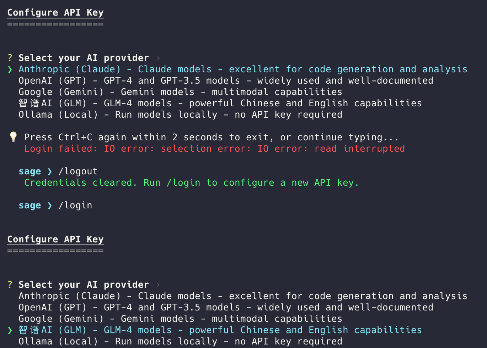

<div align="center">

# Sage 🦀

**Rust-native code agent in a single binary**

Open-source software engineering agent CLI.<br/>
Local startup benchmark • Single binary • Works offline with Ollama

[](https://www.rust-lang.org/)
[](LICENSE)
[](https://github.com/majiayu000/sage/actions)
[](https://github.com/majiayu000/sage/releases)

[Installation](#-quick-install) • [Features](#-features) • [Documentation](#-documentation) • [Contributing](#-contributing)

</div>

---

<!-- Demo GIF placeholder - record with: vhs demo/demo.tape -->
<!--
<div align="center">
  
</div>
-->

## 选择 Sage 工作流

Sage Agent 是以 `sage-cli` 包分发的 Rust 编码代理，运行命令为 `sage`。本仓库目前仅维护已有功能；使用前请结合[限制](#limitations)评估实际工作流。

| 任务 | 入口 | 预期行为 |
|---|---|---|
| 了解陌生项目 | `sage "先解释项目结构，不要修改文件"` | 在当前工作区交互执行；审查工具请求。 |
| 执行有限步数的一次性任务 | `sage -p "解释这段代码" --max-steps 5` | 非交互执行后退出；步数上限不等于费用上限。 |
| 继续之前的任务 | `sage -c` 或 `sage -r SESSION_ID` | 继续最近会话，或选择指定的已保存会话。 |
| 使用本地模型 | [Ollama 配置](docs/user-guide/configuration_zh.md) | 需要已启动的本地 Ollama 和已安装模型；云端路线仍需要网络与密钥。 |

这里描述的是 Sage 自身的命令路径。启动耗时、二进制大小与模型质量受构建、机器和提供商影响，本仓库没有受控的跨产品性能对照实验。

## 🚀 Quick Install

**macOS / Linux:**
```bash
curl -fsSL https://raw.githubusercontent.com/majiayu000/sage/main/install.sh | bash
```

**Cargo (Sage CLI):**
```bash
cargo install sage-cli
```

**Homebrew:**
```bash
brew install majiayu000/sage/sage
```

## Release Status

- 最新已验证 GitHub release: [`v0.13.57`](https://github.com/majiayu000/sage/releases/tag/v0.13.57)，发布于 2026-04-30。
- GitHub release archives 是 macOS 和 Linux 的主要二进制分发路径。
- 原生 Windows 预构建 release archives 当前不发布；请使用 WSL2、源码构建或 `cargo install sage-cli`。
- Cargo 安装使用 `sage-cli` 包 (`cargo install sage-cli`)；根 workspace 中名为 `sage` 的 package 是 private，不是 crates.io 上的 CLI 包。
- Homebrew 安装使用 `majiayu000/sage` tap。

## ⚡ Quick Start

```bash
# Interactive mode (default)
sage

# Execute task interactively
sage "Create a Python script that fetches GitHub trending repos"

# Print mode - execute and exit (non-interactive)
sage -p "Explain this code"

# Continue most recent session
sage -c

# Resume specific session
sage -r <session-id>
```

### 首次任务前检查配置

```bash
sage --version
sage --help
sage config init
sage config validate
sage doctor
```

在目标项目目录中运行。`config init` 创建默认的 `sage_config.json`；按[配置指南](docs/user-guide/configuration_zh.md)设置提供商后，再验证配置。诊断输出可能包含环境信息，提交问题前删除密钥和私有项目数据。

### 任务与会话问题

- **`-p` 会把文件操作限制为只读吗？** 不会，它选择非交互执行。工具仍可能编辑文件、运行命令；使用合适的项目副本并检查结果。
- **应该用 `sage run` 或 `sage interactive` 吗？** 当前入口是 `sage "任务"`、`sage -p "任务"` 或直接 `sage`。旧指南不一致时，以已安装版本的 `sage --help` 为准。
- **重开终端后怎么继续？** 用 `sage -c` 继续最近会话，或用 `sage -r SESSION_ID` 选择会话；两者互斥，不能同时使用。
- **Ollama 路线全部离线吗？** 模型安装后推理可在本地进行；Web 等网络工具仍依赖连接。详见下面的限制。

## Limitations

- Sage 可以在当前 workspace 中编辑文件并运行 shell 命令；请审查 tool request，并在可信 checkout 中运行。
- Cloud LLM providers 需要用户自行提供 API key。只有基于 Ollama 的 workflow 设计为离线使用。
- Web、browser、MCP 和 model-list 功能依赖本地服务或网络可用性；这些依赖不可用时功能可能失败。
- Startup benchmark 数字只测量本地进程启动耗时，不测量模型延迟、任务质量或端到端编码速度。
- Provider support 限于已发布的 provider 集和文档化的 OpenAI-compatible routes。

## ✨ Features

### 🚀 Performance
- **Fast startup path** - Rust-native binary with a local benchmark script for verification
- **Single ~15MB binary** - No dependencies, instant install
- **Efficient memory** - Low footprint, handles large codebases

### 🤖 Multi-LLM Support
- **Anthropic** - Claude-compatible models
- **OpenAI** - GPT-compatible models
- **Google** - Gemini-compatible models
- **Z.AI** - GLM-5.1 和 GLM-5
- **Moonshot AI** - Kimi-compatible models
- **Ollama** - Llama, Mistral, CodeLlama (offline)
- **Azure OpenAI** - Enterprise deployments
- **OpenRouter** - Access 100+ models
- **Doubao** - ByteDance models
- **GLM** - Zhipu AI models

### 🛠️ 40+ Built-in Tools
| Category | Tools |
|----------|-------|
| **File Ops** | Read, Write, Edit, Glob, Grep, NotebookEdit |
| **Shell** | Bash, KillShell, Task, TaskOutput |
| **Web** | WebSearch, WebFetch, Browser |
| **Planning** | TodoWrite, EnterPlanMode, ExitPlanMode |
| **Git** | Full Git integration |

### 🧠 Advanced Features
- **Memory System** - Learns your coding patterns across sessions
- **Checkpoints** - Save and restore agent state
- **Trajectory Recording** - Full execution history for debugging
- **MCP Protocol** - Extend with Model Context Protocol servers
- **Plugin System** - Custom tool development

### 💬 Claude Code Compatible
- **16+ Slash Commands** - `/resume`, `/undo`, `/cost`, `/plan`, `/compact`, `/title`, etc.
- **Session Resume** - Continue where you left off (`sage -c` or `sage -r <id>`)
- **Interactive Mode** - Multi-turn conversations
- **File Change Tracking** - Built-in undo support

## 📖 Usage

### Interactive Mode

```bash
# Start interactive session
sage

# Or with initial task
sage "Create a REST API with user authentication"
```

```
> Create a REST API with user authentication

[Sage creates files, runs commands, shows progress...]

> /cost
┌─────────────────────────────────┐
│ Session Cost & Usage            │
├─────────────────────────────────┤
│ Input tokens:  12,450           │
│ Output tokens: 3,200            │
│ Total cost:    $0.047           │
└─────────────────────────────────┘

> /resume
[Shows list of previous sessions...]
To resume: sage -r <session-id>
```

### Print Mode (One-Shot)

```bash
# Execute task and exit (non-interactive)
sage -p "Add error handling to main.rs"

# With maximum steps
sage --max-steps 30 -p "Refactor the auth module"
```

### Session Management

```bash
# Continue most recent session
sage -c

# Resume specific session by ID
sage -r abc123
```

### Slash Commands

| Command | Description |
|---------|-------------|
| `/help` | Show help information |
| `/clear` | Clear conversation history |
| `/compact` | Summarize and compact context |
| `/resume [id]` | Resume previous session |
| `/cost` | Show token usage and cost |
| `/undo [msg-id]` | Undo file changes |
| `/plan [open\|clear]` | View/manage execution plan |
| `/checkpoint [name]` | Save current state |
| `/restore [id]` | Restore to checkpoint |
| `/context` | Show context usage |
| `/status` | Show agent status |
| `/tasks` | List background tasks |
| `/commands` | List all slash commands |
| `/title <title>` | Set session title |
| `/init` | Initialize Sage in project |
| `/config` | Manage configuration |
| `/login` | Configure API key for provider |
| `/logout` | Clear stored credentials |

#### Login/Logout Demo

<div align="center">
  
</div>

## ⚙️ Configuration

Create `sage_config.json` or use environment variables:

```json
{
  "default_provider": "anthropic",
  "model_providers": {
    "anthropic": {
      "model": "claude-opus-4-7",
      "api_key": "${ANTHROPIC_API_KEY}",
      "enable_prompt_caching": true
    },
    "zai": {
      "model": "glm-5.1",
      "api_key": "${ZAI_API_KEY}",
      "base_url": "https://api.z.ai/api/paas/v4"
    },
    "moonshot": {
      "model": "kimi-k2.6",
      "api_key": "${MOONSHOT_API_KEY}",
      "base_url": "https://api.moonshot.ai/v1"
    },
    "ollama": {
      "model": "codellama",
      "base_url": "http://localhost:11434"
    }
  },
  "max_steps": 20,
  "memory": {
    "enabled": false,
    "storage_path": ".sage/memory/agent-memory.json"
  },
  "working_directory": "."
}
```

跨会话 memory 默认关闭。将 `memory.enabled` 设为 `true` 后，Sage 会把经过上界控制和脱敏的项目记忆与学习模式注入后续 prompt。

### Environment Variables

```bash
# API Keys
export ANTHROPIC_API_KEY="sk-ant-..."
export OPENAI_API_KEY="sk-..."
export ZAI_API_KEY="..."
export MOONSHOT_API_KEY="sk-..."

# Configuration
export SAGE_DEFAULT_PROVIDER="anthropic"
export SAGE_MAX_STEPS="30"
```

## 📦 SDK

Use Sage as a library in your Rust projects:

```rust
use sage_sdk::{SageAgentSdk, RunOptions};

#[tokio::main]
async fn main() -> Result<(), Box<dyn std::error::Error>> {
    // Load from config file
    let sdk = SageAgentSdk::with_config_file("sage_config.json")?;

    // Or create with default config
    // let sdk = SageAgentSdk::new()?;

    // Run a task
    let options = RunOptions::new("Create a README file");
    let result = sdk.run(options).await?;

    println!("Execution completed: {:?}", result.outcome());

    Ok(())
}
```

## 🏗️ Architecture

```
sage/
├── crates/
│   ├── sage-core/      # Core agent logic, LLM providers, session, tools
│   ├── sage-cli/       # Command-line interface
│   ├── sage-sdk/       # High-level SDK for embedding
│   └── sage-tools/     # Built-in tool implementations
├── docs/               # Documentation
├── examples/           # Usage examples
└── benchmarks/         # Performance benchmarks
```

## 🧪 Benchmarks

Run the startup benchmark:

```bash
./benchmarks/startup.sh
```

```
Code Agent Startup Benchmark
━━━━━━━━━━━━━━━━━━━━━━━━━━━━

Agent            Avg (ms)
────────────────────────────
sage             45
claude           520
aider            780

Sage is 11.5x faster than Claude Code
```

Benchmark results depend on hardware, shell startup cost, installed comparison tools, and the selected iteration count. Re-run the script locally before relying on the numbers.

## 📚 Documentation

- [User Guide](docs/user-guide/) - Getting started, configuration, usage
- [Architecture](docs/architecture/) - System design, components
- [Tools Reference](docs/tools/) - All available tools
- [Development](docs/development/) - Contributing, building

## 🤝 Contributing

Contributions are welcome! Please read our [Contributing Guide](CONTRIBUTING.md).

```bash
# Clone
git clone https://github.com/majiayu000/sage
cd sage

# Build
cargo build --workspace --release

# Test
cargo test --workspace --all-targets

# Run
./target/release/sage --help
```

Local developer state directories such as `.claude/` and `.omx/` are
intentionally ignored and should not be committed.

## 📄 License

MIT License - see [LICENSE](LICENSE) for details.

Sage is a Rust rewrite inspired by [Trae Agent](https://github.com/bytedance/trae-agent), which is also MIT licensed.
Third-party attribution and retained original MIT notices are listed in [NOTICE](NOTICE).

## 🙏 Acknowledgments

Inspired by:
- [Claude Code](https://claude.ai/code) - Anthropic's CLI tool design
- [Trae Agent](https://github.com/bytedance/trae-agent) - ByteDance's agent architecture
- [Aider](https://github.com/paul-gauthier/aider) - AI pair programming

---

<div align="center">

**[⭐ Star us on GitHub](https://github.com/majiayu000/sage)** if you find Sage useful!

Made with 🦀 by the Sage Team

</div>
