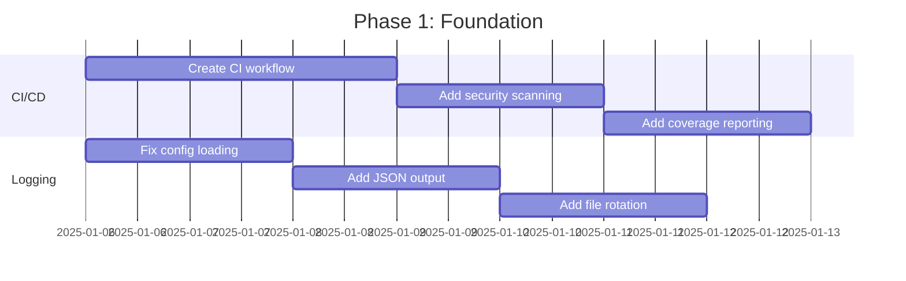

# Sage Agent - Comprehensive Refactor Analysis

> **Generated:** 2025-12-22
> **Analysis Method:** Multi-skill deep analysis using rust-project, api-design, structured-logging, observability-sre, devops-excellence, technical-spec, and contribution-architect patterns

---

## Executive Summary

This document provides a comprehensive analysis of the Sage Agent codebase across seven critical dimensions: Rust architecture, API design, logging/tracing, observability, DevOps/CI-CD, technical specification compliance, and technical debt identification.

### Project Overview

| Metric | Value |
|--------|-------|
| Total Lines of Code | 106,285 Rust |
| Crates | 4 (sage-core, sage-cli, sage-sdk, sage-tools) |
| Tool Implementations | 40+ |
| Documentation Files | 53 markdown |
| Test Coverage | 795 unit tests, 4 integration tests |
| TODO Comments | 72 |

### Overall Assessment Score

| Dimension | Score | Status |
|-----------|-------|--------|
| Rust Architecture | 8.5/10 | Strong |
| API Design | 7.5/10 | Good |
| Logging/Tracing | 5/10 | Needs Work |
| Observability | 4/10 | Minimal |
| DevOps/CI-CD | 2/10 | Critical Gap |
| Documentation | 6/10 | Partial |
| Code Quality | 7.5/10 | Good |

---

## Table of Contents

1. [Rust Architecture Analysis](#1-rust-architecture-analysis)
2. [API Design Review](#2-api-design-review)
3. [Logging and Tracing Assessment](#3-logging-and-tracing-assessment)
4. [Observability Infrastructure](#4-observability-infrastructure)
5. [DevOps and CI/CD Analysis](#5-devops-and-cicd-analysis)
6. [Technical Debt Inventory](#6-technical-debt-inventory)
7. [Documentation Gaps](#7-documentation-gaps)
8. [Refactoring Recommendations](#8-refactoring-recommendations)
9. [Implementation Roadmap](#9-implementation-roadmap)

---

## 1. Rust Architecture Analysis

### 1.1 Workspace Structure

**Current Architecture:**
```
sage/
├── Cargo.toml (workspace)
├── crates/
│   ├── sage-core/     # Core library (74,789 LOC)
│   ├── sage-cli/      # CLI binary
│   ├── sage-sdk/      # High-level SDK
│   └── sage-tools/    # Tool implementations (40+)
```

**Dependency Graph:**
```
sage-cli → [sage-core, sage-sdk, sage-tools]
sage-sdk → [sage-core, sage-tools]
sage-tools → [sage-core]
sage-core → [standalone]
```

### 1.2 Strengths

1. **Clean Layered Architecture**
   - No circular dependencies
   - Clear separation of concerns
   - sage-core as foundational library

2. **Excellent Error Handling**
   - Uses both `thiserror` (specific errors) and `anyhow` (context-rich)
   - `SageError` enum with domain-specific variants
   - `SageResult<T>` type alias for consistency

3. **Sophisticated Async Patterns**
   - `ParallelToolExecutor` with semaphore-based concurrency control
   - Multiple execution modes: Parallel, Sequential, Limited, ExclusiveByType
   - Proper cancellation token support via `tokio_util`

4. **Strong Type System Usage**
   - Type-safe identifiers (`SessionId`, `ToolCallId`, `AgentId`)
   - Domain enums (`LLMProvider`, `RiskLevel`, `ConcurrencyMode`)
   - Builder patterns throughout

### 1.3 Issues Identified

| Issue | Severity | Location |
|-------|----------|----------|
| Module proliferation in sage-core (35+ modules) | Medium | `sage-core/src/` |
| Dual `ModelParameters` definition | High | `config::model` & `llm::providers` |
| Large files (>1000 LOC) | Medium | 5 files identified |
| High coupling in SDK re-exports | Medium | `sage-sdk/src/lib.rs` |

### 1.4 Recommendations

```rust
// BEFORE: Dual ModelParameters definition
// config/model.rs
pub struct ModelParameters { ... }

// llm/providers.rs
pub struct ModelParameters { ... }  // Duplicate!

// AFTER: Single source of truth
// types/model.rs
pub struct ModelParameters { ... }

// Re-export everywhere
pub use crate::types::ModelParameters;
```

---

## 2. API Design Review

### 2.1 Tool Trait System

**Current Implementation:**
```rust
#[async_trait]
pub trait Tool: Send + Sync {
    fn name(&self) -> &str;
    fn description(&self) -> &str;
    fn schema(&self) -> ToolSchema;
    async fn execute(&self, call: ToolCall) -> ToolResult;

    // Optional hooks
    async fn validate(&self, call: &ToolCall) -> Result<(), ToolError> { Ok(()) }
    async fn check_permission(&self, call: &ToolCall) -> PermissionResult { PermissionResult::Allow }
    fn risk_level(&self) -> RiskLevel { RiskLevel::Low }
    fn concurrency_mode(&self) -> ConcurrencyMode { ConcurrencyMode::Parallel }
}
```

**Strengths:**
- Clean async trait with optional hooks
- Risk-based permission system
- Concurrency awareness

**Weaknesses:**
- No lifecycle hooks (init/cleanup)
- Schema uses `serde_json::Value` (no compile-time validation)
- String-based tool names (could use newtype)

### 2.2 LLM Provider Abstraction

**Multi-Provider Support:**
- OpenAI, Anthropic, Google, Azure, OpenRouter, Doubao, Ollama, GLM
- Custom provider support via `Custom(String)` variant
- Unified `LLMClient` interface

**Issues:**
- Error abstraction gap (provider errors → generic `SageError::Llm(String)`)
- Only OpenAI streaming fully implemented
- Provider-specific code scattered throughout client

### 2.3 SDK Public API

**Current API Surface:**
```rust
pub struct SageAgentSDK { ... }

impl SageAgentSDK {
    pub fn new() -> Self;
    pub fn with_config(config: Config) -> Self;
    pub fn with_config_file(path: &Path) -> Result<Self, ConfigError>;
    pub fn with_provider_and_model(self, provider: &str, model: &str) -> Self;
    pub fn with_max_steps(self, steps: Option<usize>) -> Self;
    pub async fn run(&self, task: &str) -> ExecutionResult;
}
```

**Missing Capabilities:**
- No pause/resume
- No streaming output interface
- No cancellation token exposure
- No multi-turn conversation support

---

## 3. Logging and Tracing Assessment

### 3.1 Current State

**Configuration (sage-cli/src/main.rs:232-234):**
```rust
tracing_subscriber::fmt()
    .with_env_filter(tracing_subscriber::EnvFilter::from_default_env())
    .init();
```

**Usage Statistics:**
- 134 occurrences of `tracing::` macros
- Levels used: debug, info, warn (minimal error)
- No JSON structured output
- No distributed tracing spans

### 3.2 Critical Gaps

| Gap | Impact | Best Practice |
|-----|--------|---------------|
| No JSON logging | Cannot parse logs programmatically | Enable `tracing-subscriber` JSON layer |
| No trace correlation | Cannot track requests across async boundaries | Add trace_id to all logs |
| Config ignored | Config file logging settings unused | Respect `sage_config.json` settings |
| Credential leak risk | API keys/connection strings may be logged | Add sensitive data filter |
| No `#[instrument]` | Manual span creation everywhere | Use instrument macro for automatic spans |
| No log files | Console only | Implement file output with rotation |

### 3.3 Recommended Configuration

```rust
// AFTER: Proper tracing setup
use tracing_subscriber::{layer::SubscriberExt, util::SubscriberInitExt, fmt, EnvFilter};

fn init_tracing(config: &LoggingConfig) -> Result<()> {
    let filter = EnvFilter::try_from_default_env()
        .unwrap_or_else(|_| EnvFilter::new(&config.level));

    let fmt_layer = fmt::layer()
        .with_target(true)
        .with_thread_ids(true)
        .with_file(true)
        .with_line_number(true);

    let json_layer = if config.format == "json" {
        Some(fmt::layer().json())
    } else {
        None
    };

    tracing_subscriber::registry()
        .with(filter)
        .with(fmt_layer)
        .with(json_layer)
        .init();

    Ok(())
}
```

---

## 4. Observability Infrastructure

### 4.1 Current Telemetry Module

**Location:** `sage-core/src/telemetry/`

**Existing Components:**
- `MetricsCollector` - Internal metrics collection
- Counter, Gauge, Histogram metric types
- `SharedMetricsCollector` via Arc<Mutex>

**Missing Infrastructure:**

| Component | Status | Priority |
|-----------|--------|----------|
| Prometheus exporter | Not implemented | High |
| OpenTelemetry integration | Not implemented | High |
| Distributed tracing | Not implemented | High |
| Health check endpoints | Not implemented | Medium |
| SLO/SLI definitions | Not defined | Medium |
| Error budget tracking | Not implemented | Low |

### 4.2 Recommended Stack

```yaml
Metrics: Prometheus + Grafana
Tracing: OpenTelemetry → Tempo/Jaeger
Logging: Loki (low-cardinality labels)
Alerting: AlertManager with SLO-based alerts
```

### 4.3 Key SLIs to Implement

```yaml
# Availability SLI
availability:
  query: sum(rate(agent_requests_success[5m])) / sum(rate(agent_requests_total[5m]))
  target: 99.9%

# Latency SLI
latency:
  query: histogram_quantile(0.95, sum(rate(agent_request_duration_bucket[5m])) by (le))
  target: <30s for simple tasks

# Error Rate SLI
error_rate:
  query: sum(rate(agent_errors_total[5m])) / sum(rate(agent_requests_total[5m]))
  target: <0.1%
```

---

## 5. DevOps and CI/CD Analysis

### 5.1 Current State: CRITICAL GAP

**Existing Infrastructure:**
- Only ONE GitHub Actions workflow: `doc-consistency.yml`
- No automated builds
- No automated tests in CI
- No security scanning
- No container support

### 5.2 Missing CI/CD Components

| Component | Status | Priority |
|-----------|--------|----------|
| Build pipeline | Missing | CRITICAL |
| Test automation | Missing | CRITICAL |
| Security scanning (cargo-audit) | Missing | CRITICAL |
| Container support (Dockerfile) | Missing | HIGH |
| Release automation | Missing | HIGH |
| Code coverage | Missing | MEDIUM |
| Dependency updates | Missing | MEDIUM |

### 5.3 Recommended GitHub Actions Workflow

```yaml
# .github/workflows/ci.yml
name: CI

on:
  push:
    branches: [main]
  pull_request:

env:
  CARGO_TERM_COLOR: always

jobs:
  check:
    runs-on: ubuntu-latest
    steps:
      - uses: actions/checkout@v4
      - uses: dtolnay/rust-toolchain@stable
      - uses: Swatinem/rust-cache@v2
      - run: cargo check --all-targets

  test:
    runs-on: ubuntu-latest
    needs: check
    steps:
      - uses: actions/checkout@v4
      - uses: dtolnay/rust-toolchain@stable
      - uses: Swatinem/rust-cache@v2
      - run: cargo test --all

  clippy:
    runs-on: ubuntu-latest
    needs: check
    steps:
      - uses: actions/checkout@v4
      - uses: dtolnay/rust-toolchain@stable
        with:
          components: clippy
      - uses: Swatinem/rust-cache@v2
      - run: cargo clippy -- -D warnings

  security:
    runs-on: ubuntu-latest
    needs: check
    steps:
      - uses: actions/checkout@v4
      - uses: dtolnay/rust-toolchain@stable
      - run: cargo install cargo-audit
      - run: cargo audit

  coverage:
    runs-on: ubuntu-latest
    needs: test
    steps:
      - uses: actions/checkout@v4
      - uses: dtolnay/rust-toolchain@stable
      - run: cargo install cargo-tarpaulin
      - run: cargo tarpaulin --out Xml
      - uses: codecov/codecov-action@v3
```

### 5.4 Recommended Dockerfile

```dockerfile
# Build stage
FROM rust:1.75-alpine AS builder
RUN apk add --no-cache musl-dev
WORKDIR /app
COPY . .
RUN cargo build --release --bin sage

# Runtime stage
FROM alpine:3.19
RUN addgroup -g 1001 -S sage && \
    adduser -S sage -u 1001
COPY --from=builder /app/target/release/sage /usr/local/bin/
USER sage
ENTRYPOINT ["sage"]
```

---

## 6. Technical Debt Inventory

### 6.1 TODO Comments (72 Total)

**Critical (Blocking Features):**

| Location | Issue | Priority |
|----------|-------|----------|
| `trajectory/recorder.rs:347-421` | 7 methods return stubs, marked "Fix after trajectory storage refactor" | HIGH |
| `llm/client.rs:2027-2072` | Streaming not implemented for 6 providers (Google, Azure, OpenRouter, Doubao, Ollama, GLM) | HIGH |
| `tools/executor.rs:16-26` | Missing: dependency management, resource management, security sandboxing | HIGH |

**Medium Priority:**

| Location | Issue |
|----------|-------|
| `network/web_fetch.rs:48` | "Implement actual web fetching functionality" |
| `network/web_search.rs:79` | "Implement actual web search functionality" |
| `diagnostics/` | 4 stub implementations |
| `monitoring/test_generator.rs` | 16 TODOs (template generation) |

**Low Priority:**
- `sage-core/src/lib.rs:43` - Plugin marketplace integration
- Various development tools and data processing tools

### 6.2 Code Quality Metrics

| Metric | Value | Assessment |
|--------|-------|------------|
| `unwrap()` calls | 1,414 | Medium concern (138 files) |
| `clone()` calls | 957 | Acceptable |
| `unsafe` blocks | 3 files only | Good |
| `expect()` calls | 5 | Good |
| `panic!`/`unreachable!` | 4 | Good |
| Files with tests | 115 | Good |
| Unit tests | 795 | Good |

### 6.3 Large Files Requiring Refactoring

| File | Lines | Recommendation |
|------|-------|----------------|
| `llm/client.rs` | 2,075 | Extract provider-specific modules |
| `session/types.rs` | 1,240 | Decompose into domain modules |
| `tools/permission.rs` | 1,204 | Separate permission strategies |
| `input/mod.rs` | 1,097 | Extract channel implementations |
| `agent/lifecycle.rs` | 1,009 | Consider state machine library |

### 6.4 Architectural Issues

1. **Dual Configuration Types**
   - `ModelParameters` defined in two places
   - Creates maintenance burden and inconsistency risk

2. **Error Information Loss**
   - Provider errors converted to `SageError::Llm(String)`
   - Loses structured error information

3. **SDK-Core Coupling**
   - SDK directly re-exports Core types
   - Makes API evolution difficult

---

## 7. Documentation Gaps

### 7.1 Missing User-Facing Documentation

| Document | Status | Priority |
|----------|--------|----------|
| `user-guide/getting-started.md` | Missing | CRITICAL |
| `user-guide/configuration.md` | Missing | CRITICAL |
| `user-guide/cli-reference.md` | Missing | HIGH |
| `user-guide/sdk-usage.md` | Missing | HIGH |
| `user-guide/troubleshooting.md` | Missing | MEDIUM |

### 7.2 Missing Developer Documentation

| Document | Status | Priority |
|----------|--------|----------|
| `development/setup.md` | Missing | HIGH |
| `development/contributing.md` | Missing | HIGH |
| `development/testing.md` | Missing | MEDIUM |
| API reference examples | 3 only | HIGH |

### 7.3 Tool Documentation Coverage

**Documented:** 11/40+ tools (27.5%)

**Missing Documentation:**
- Database tools
- Network tools (partially stubbed)
- Email tools
- Data processing tools
- Security tools
- LSP tools
- WebDriver tools
- Package manager tools
- CI/CD tools

---

## 8. Refactoring Recommendations

### 8.1 Priority 1: Critical (Complete in 2 weeks)

#### P1.1: Add CI/CD Pipeline
```yaml
Files to Create:
- .github/workflows/ci.yml
- .github/workflows/release.yml
- .github/workflows/security.yml
```

#### P1.2: Complete Trajectory Refactor
```
Location: sage-core/src/trajectory/
Actions:
- Implement load_trajectory()
- Implement list_trajectories()
- Implement delete_trajectory()
- Implement get_statistics()
- Add storage backend abstraction
```

#### P1.3: Fix Logging Configuration
```rust
// sage-cli/src/main.rs
- Respect sage_config.json logging settings
- Enable JSON output option
- Add file output with rotation
- Add sensitive data filter
```

### 8.2 Priority 2: High (Complete in 4 weeks)

#### P2.1: Consolidate ModelParameters
```
Actions:
- Create single ModelParameters in types/model.rs
- Remove duplicate in llm/providers.rs
- Update all imports
```

#### P2.2: Implement Provider Streaming
```
Providers Needing Implementation:
- Google
- Azure
- OpenRouter
- Doubao
- Ollama
- GLM
```

#### P2.3: Add Containerization
```dockerfile
Create:
- Dockerfile (multi-stage)
- docker-compose.yml (development)
- .dockerignore
```

### 8.3 Priority 3: Medium (Complete in 8 weeks)

#### P3.1: Refactor Large Files
```
Target Files:
- llm/client.rs → Extract provider modules
- session/types.rs → Decompose by domain
- tools/permission.rs → Extract strategies
- input/mod.rs → Separate channel types
```

#### P3.2: Complete Documentation
```
Create:
- All user-guide documents
- Development setup guide
- API reference with examples
- Tool documentation (29+ remaining)
```

#### P3.3: Add Observability
```
Implement:
- OpenTelemetry integration
- Prometheus metrics exporter
- Health check endpoints
- Distributed tracing
```

### 8.4 Priority 4: Low (Complete in 12 weeks)

- Plugin marketplace integration
- Advanced MCP features
- Performance optimization
- Additional tool implementations

---

## 9. Implementation Roadmap

### Phase 1: Foundation (Weeks 1-2)



### Phase 2: Stabilization (Weeks 3-4)

- Complete trajectory refactor
- Consolidate ModelParameters
- Add container support
- Implement 3 provider streaming implementations

### Phase 3: Enhancement (Weeks 5-8)

- Refactor large files
- Complete user documentation
- Add observability infrastructure
- Implement remaining provider streaming

### Phase 4: Polish (Weeks 9-12)

- Complete tool documentation
- Add advanced observability
- Performance optimization
- Plugin system enhancements

---

## Appendix A: File Reference

### Critical Files for Refactoring

| Path | Lines | Priority |
|------|-------|----------|
| `crates/sage-core/src/llm/client.rs` | 2,075 | P2 |
| `crates/sage-core/src/session/types.rs` | 1,240 | P3 |
| `crates/sage-core/src/tools/permission.rs` | 1,204 | P3 |
| `crates/sage-core/src/input/mod.rs` | 1,097 | P3 |
| `crates/sage-core/src/agent/lifecycle.rs` | 1,009 | P3 |
| `crates/sage-core/src/workspace/analyzer.rs` | 996 | P4 |
| `crates/sage-core/src/workspace/detector.rs` | 972 | P4 |
| `crates/sage-core/src/hooks/types.rs` | 968 | P4 |

### Files with TODO Comments

Total: 72 TODO comments across 23 files

Top files by TODO count:
1. `monitoring/test_generator.rs` - 16 TODOs
2. `llm/client.rs` - 8 TODOs
3. `trajectory/recorder.rs` - 5 TODOs
4. `sage-tools/src/lib.rs` - 5 TODOs
5. `tools/executor.rs` - 3 TODOs

---

## Appendix B: Skill Reference

This analysis was conducted using the following skill frameworks:

1. **rust-project** - Rust workspace architecture best practices
2. **api-design** - REST/GraphQL/gRPC API design patterns (adapted for SDK)
3. **structured-logging** - Centralized logging architecture patterns
4. **observability-sre** - Metrics, traces, SLO/SLI best practices
5. **devops-excellence** - CI/CD pipeline and container patterns
6. **technical-spec** - Design document and ADR patterns
7. **contribution-architect** - Technical debt and code quality analysis

---

## Appendix C: Metrics Summary

### Code Metrics
- **Total Rust Lines:** 106,285
- **Crates:** 4
- **Modules in sage-core:** 35
- **Tool Implementations:** 40+
- **Unit Tests:** 795
- **Integration Tests:** 4

### Quality Metrics
- **unwrap() calls:** 1,414
- **clone() calls:** 957
- **unsafe blocks:** 3 files
- **TODO comments:** 72
- **Files >1000 LOC:** 5

### Documentation Metrics
- **Markdown files:** 53
- **Documentation lines:** 18,614
- **Example files:** 22
- **Example lines:** 2,612
- **Rustdoc examples:** 3

---

*Document generated by comprehensive skill-based analysis on 2025-12-22*
