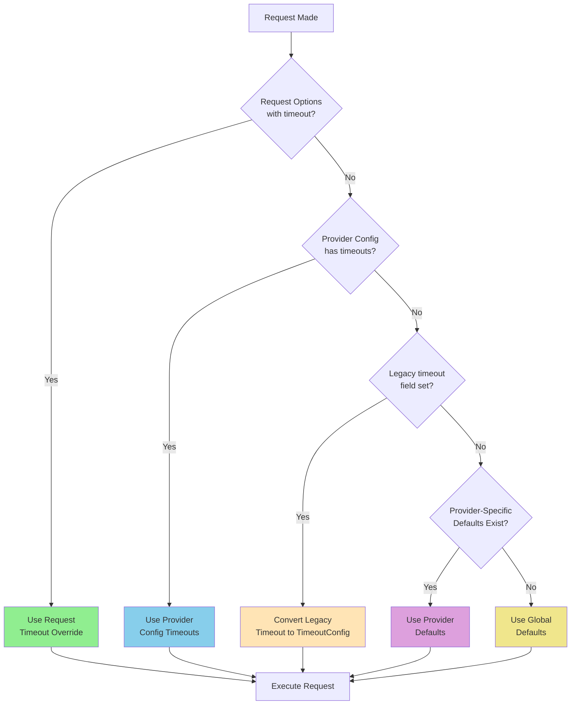
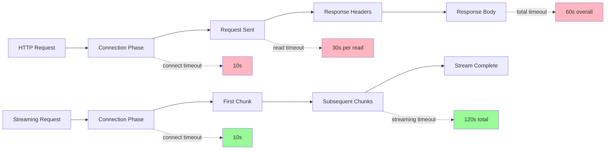
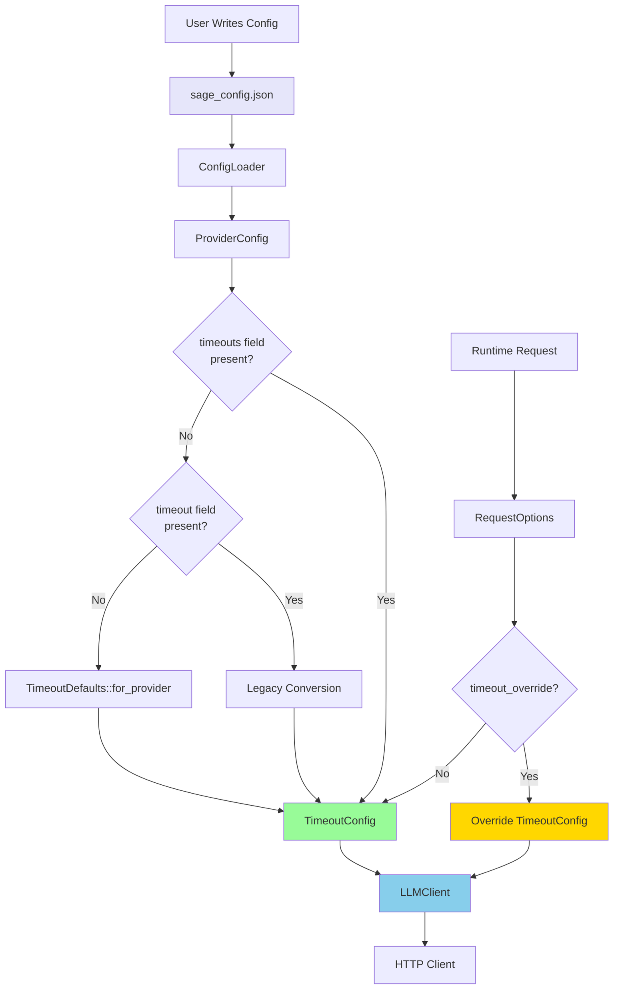
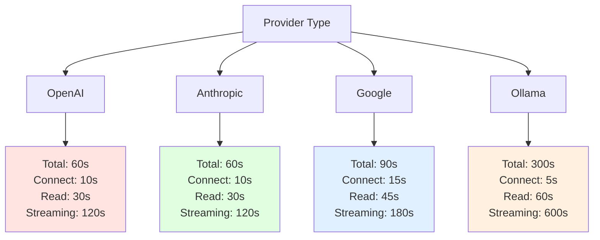
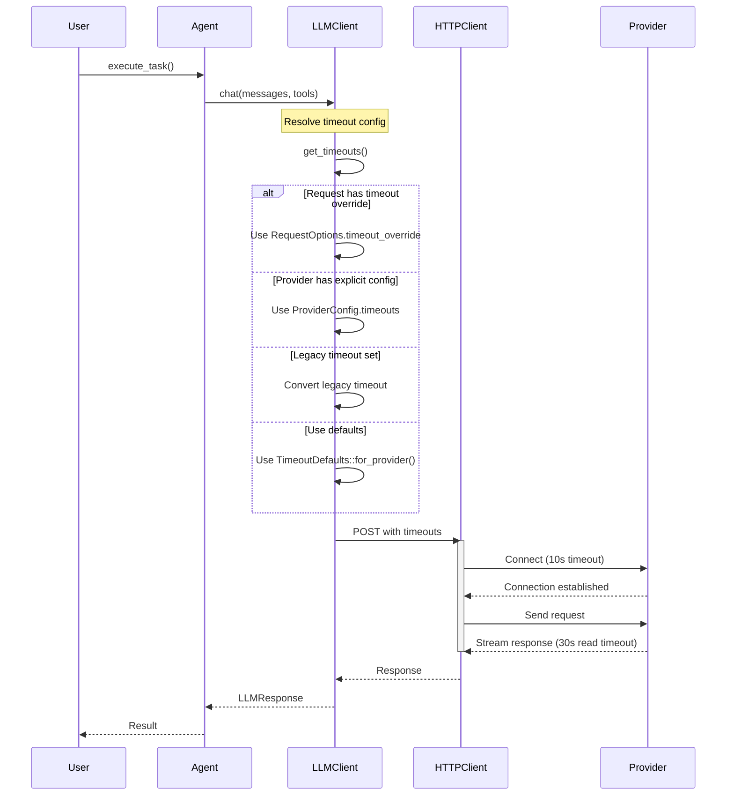
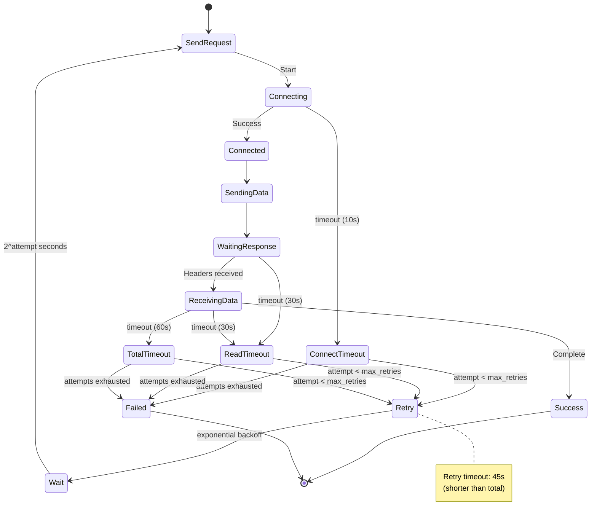
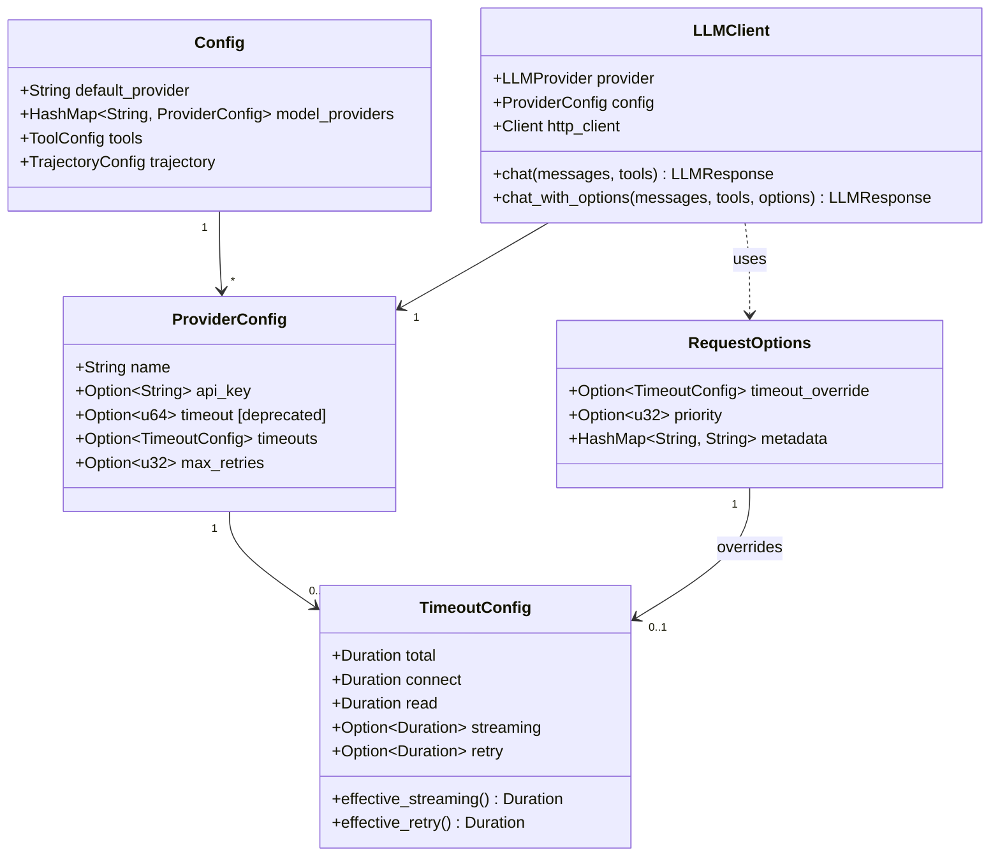
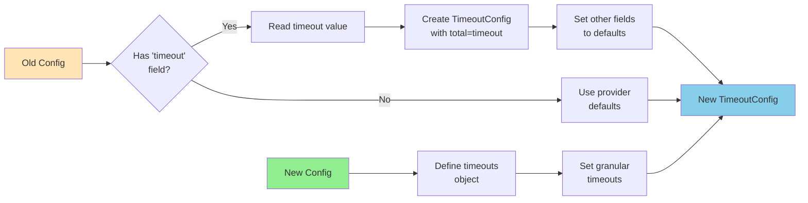
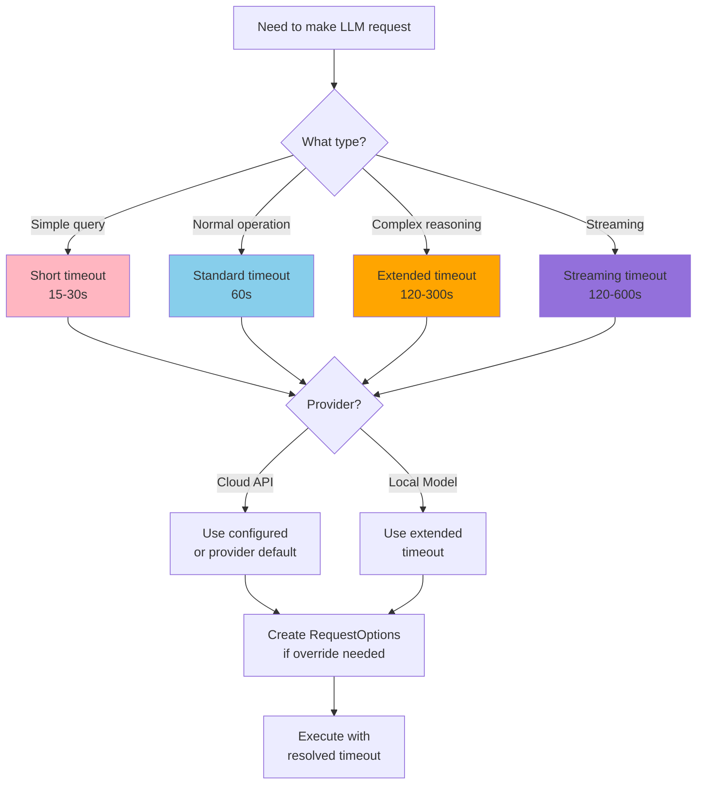
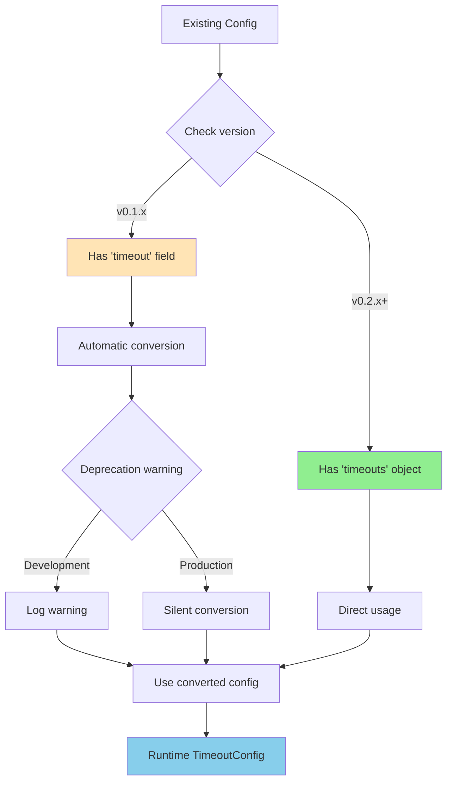

# Timeout Configuration Diagrams

## 1. Timeout Resolution Hierarchy



## 2. Timeout Types and Application



## 3. Configuration Sources Flow



## 4. Provider-Specific Defaults



## 5. Request Execution with Timeouts



## 6. Timeout Failure and Retry Flow



## 7. Configuration File Structure



## 8. Migration Path (Legacy to New)



## 9. Timeout Decision Tree



## 10. Backward Compatibility



## Legend

- 🟢 Green: Recommended/New approach
- 🔵 Blue: Standard/Normal flow
- 🟡 Yellow: Legacy/Deprecated
- 🟣 Purple: Special cases
- 🔴 Red: Error/Failed state

## Quick Reference Table

| Timeout Type | Default | OpenAI | Anthropic | Google | Ollama | When Applied |
|--------------|---------|--------|-----------|--------|--------|--------------|
| **Total**    | 60s     | 60s    | 60s       | 90s    | 300s   | Entire request |
| **Connect**  | 10s     | 10s    | 10s       | 15s    | 5s     | TCP + TLS handshake |
| **Read**     | 30s     | 30s    | 30s       | 45s    | 60s    | Between receiving bytes |
| **Streaming**| 120s    | 120s   | 120s      | 180s   | 600s   | SSE/streaming responses |
| **Retry**    | 45s     | 45s    | 45s       | 60s    | 180s   | Individual retry attempt |

## Example Scenarios

### Scenario 1: Quick Question
```
User: "What is 2+2?"
Timeout: 15s total (request override)
Rationale: Simple query, expect fast response
```

### Scenario 2: Code Analysis
```
User: "Analyze this 1000-line codebase"
Timeout: 120s total, 180s streaming
Rationale: Complex task, may need extended processing
```

### Scenario 3: Local Model
```
Provider: Ollama
Timeout: 300s total, 600s streaming
Rationale: Local inference is slower, needs more time
```

### Scenario 4: Production API
```
Provider: Anthropic/OpenAI
Timeout: 60s total (default)
Rationale: Production APIs should be fast and reliable
```
